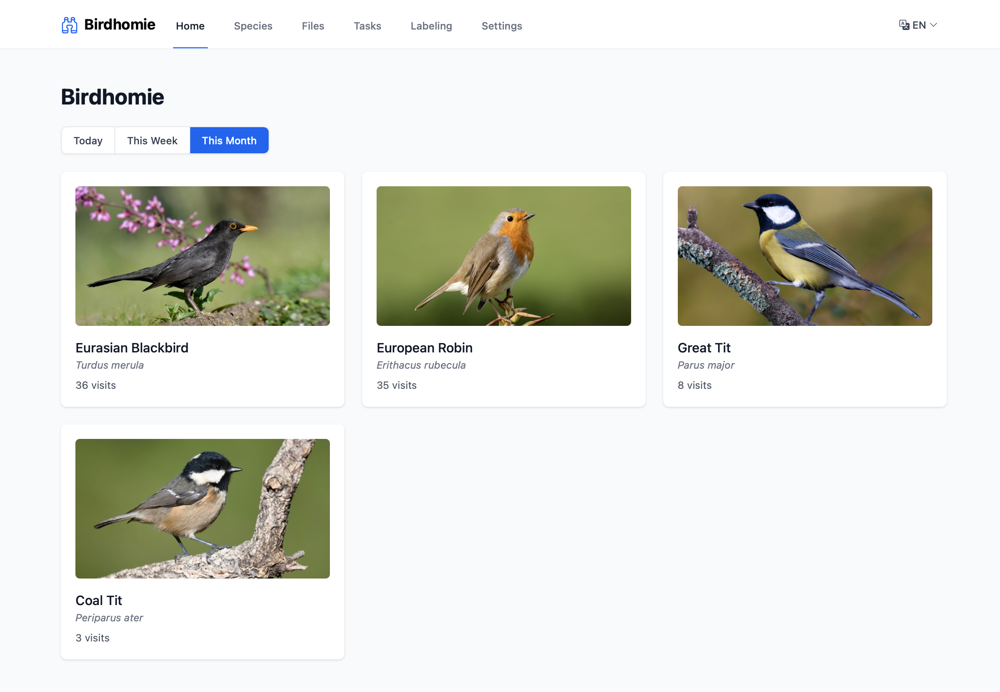
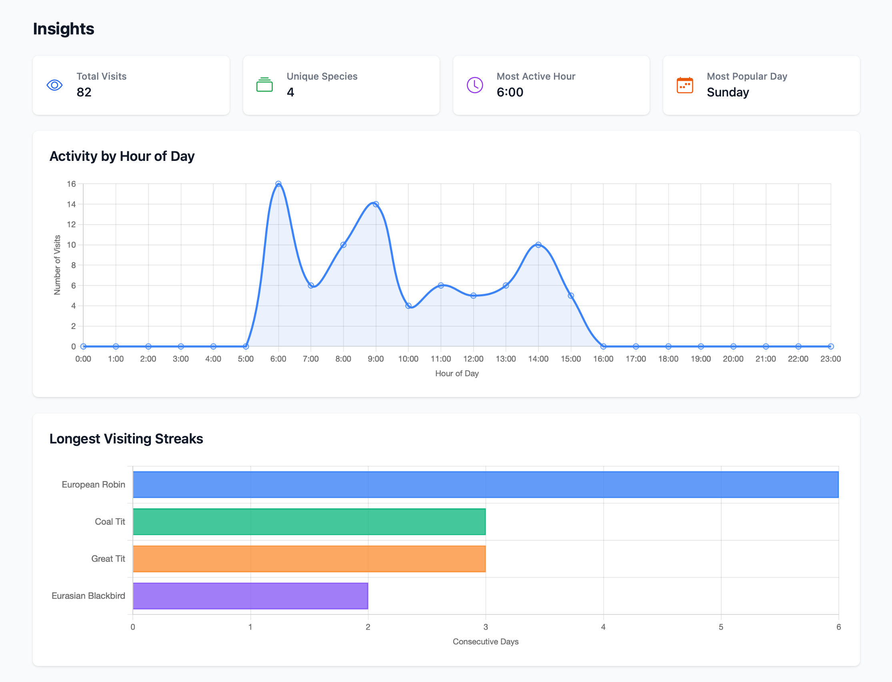
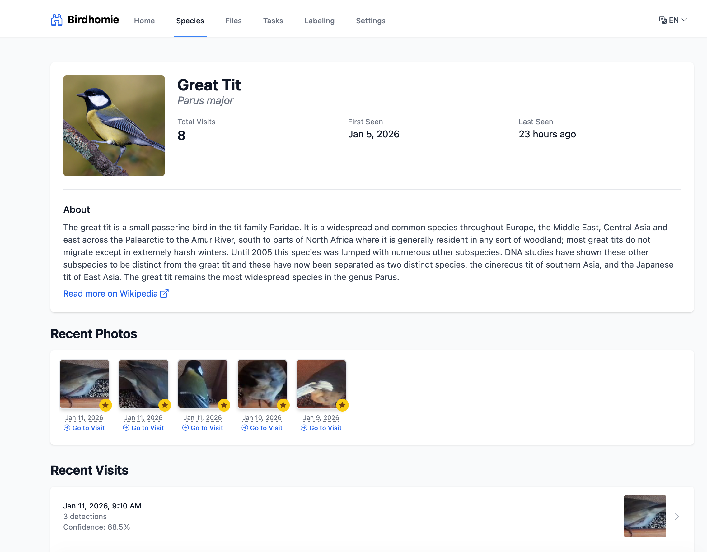
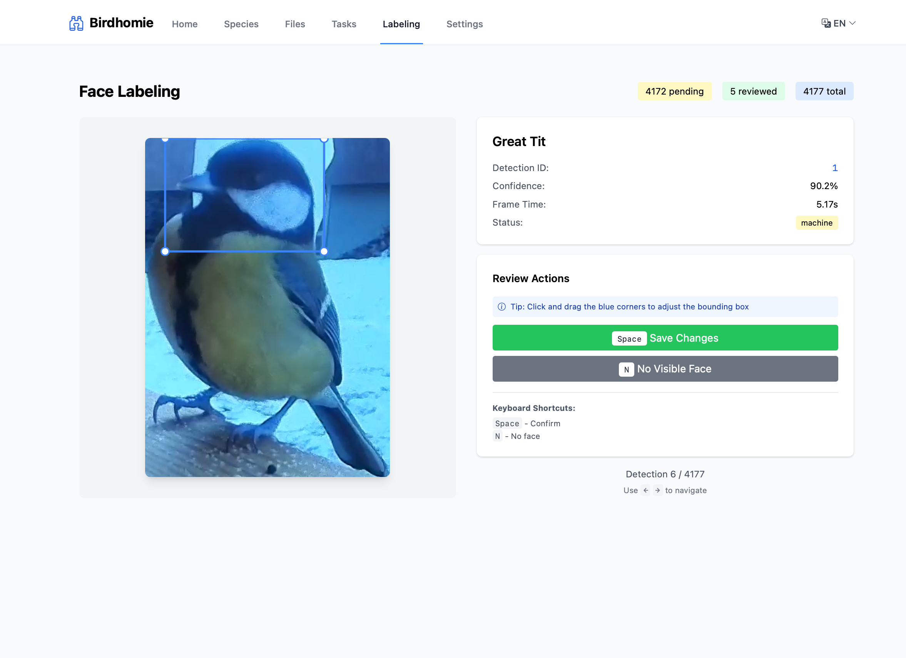
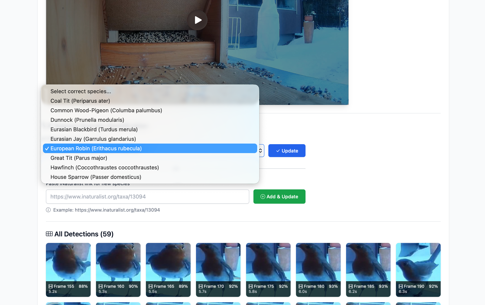

# Birdhomie

Bird detection and classification system for UniFi Protect with web interface.


## Screenshots

| Home | Insights | Species Detail | Face Labeling | Species Correction |
|:----:|:--------:|:--------------:|:-------------:|:------------------:|
| [](docs/screenshot-home.png) | [](docs/screenshot-insights.png) | [](docs/screenshot-species.png) | [](docs/screenshot-labeling.png) | [](docs/screenshot-species-correction.png) |

## Features

- Automatic bird detection using YOLOv8m
- Species classification using BioCLIP-2
- Face detection and annotation for bird portraits
- UniFi Protect integration for automatic video download
- Web interface for viewing detections and species
- Species information from iNaturalist and Wikipedia
- Visit tracking and photo galleries
- Manual labeling interface for reviewing face annotations
- Internationalization support (English, German)

## Quick Start with Docker (Recommended)

The easiest way to run Birdhomie is with Docker. All settings have sensible defaults - you only need to configure your UniFi Protect credentials.

### 1. Create docker-compose.yml

```yaml
services:
  birdhomie:
    image: ghcr.io/dewey/birdhomie:latest
    container_name: birdhomie
    restart: unless-stopped
    ports:
      - "5000:5000"
    volumes:
      - birdhomie-data:/app/data
    environment:
      # Required: UniFi Protect credentials
      - UFP_ADDRESS=192.168.1.1
      - UFP_USERNAME=your-username
      - UFP_PASSWORD=your-password
      - UFP_CAMERA_ID=your-camera-id

volumes:
  birdhomie-data:
```

### 2. Configure UniFi Protect Credentials

Update the four required environment variables:

| Variable | Description |
|----------|-------------|
| `UFP_ADDRESS` | IP address of your UniFi Protect NVR |
| `UFP_USERNAME` | Local Access Only user username |
| `UFP_PASSWORD` | Local Access Only user password |
| `UFP_CAMERA_ID` | Camera ID (find in Protect: Settings → Camera → Advanced) |

To create a Local Access Only user, go to your UniFi Protect web UI and create a new user with "Full Management" permissions.

### 3. Start the Application

```bash
docker compose up -d
```

Access the web interface at http://localhost:5000

## Manual Installation

If you prefer running without Docker:

### Prerequisites

- macOS 13+ or Linux
- Python 3.13+
- [uv](https://github.com/astral-sh/uv) for package management
- UniFi Protect NVR with a camera configured for smart detection
- (Optional) [direnv](https://direnv.net/) for automatic environment variable loading

### Setup

```bash
# Install uv if needed
curl -LsSf https://astral.sh/uv/install.sh | sh

# Clone and install
git clone https://github.com/dewey/birdhomie
cd birdhomie
uv sync

# Configure environment
cp .envrc.example .envrc
# Edit .envrc with your UniFi Protect credentials

# If using direnv
direnv allow

# Or source manually
source .envrc

# Run in development mode
make dev
```

The application will be available at http://127.0.0.1:5001

## Configuration

All configuration options have sensible defaults. Only UniFi Protect credentials are required.

### Required Settings

| Variable | Description |
|----------|-------------|
| `UFP_ADDRESS` | IP address of your UniFi Protect NVR |
| `UFP_USERNAME` | Local Access Only user username |
| `UFP_PASSWORD` | Local Access Only user password |
| `UFP_CAMERA_ID` | Camera ID to monitor |

### Optional Settings

| Variable | Default | Description |
|----------|---------|-------------|
| `UFP_DETECTION_TYPES` | `motion` | Detection types to monitor |
| `UFP_SSL_VERIFY` | `false` | Verify SSL certificates |
| `UFP_DOWNLOAD_INTERVAL_MINUTES` | `60` | How often to check for new events |
| `PROCESSOR_INTERVAL_MINUTES` | `5` | How often to process files |
| `PROCESSOR_WORKERS` | `1` | Parallel video processing workers |
| `MIN_SPECIES_CONFIDENCE` | `0.85` | Minimum confidence for species ID (0.0-1.0) |
| `MIN_DETECTION_CONFIDENCE` | `0.80` | Minimum confidence for bird detection (0.0-1.0) |
| `FRAME_SKIP` | `5` | Process every Nth frame |
| `FILE_RETENTION_DAYS` | `30` | Days to keep processed files |

### Development Settings

| Variable | Default | Description |
|----------|---------|-------------|
| `FLASK_DEBUG` | `0` | Enable debug mode with hot reloading |
| `SECRET_KEY` | `dev-secret-key` | Flask session secret (change for production) |
| `FACE_ANNOTATION_BATCH_SIZE` | `100` | Batch size for face annotation |

## Web Interface

Access the web interface at http://localhost:5000 (Docker) or http://127.0.0.1:5001 (manual).

**Pages:**
- `/` - Dashboard with recent visits and species
- `/species` - List of all detected species
- `/species/<id>` - Species detail page with photos and visits
- `/visits/<id>` - Individual visit details with video player
- `/files` - List of all processed files
- `/tasks` - Background task status
- `/labeling` - Manual labeling interface for face annotations
- `/labeling/stats` - Labeling progress and statistics
- `/settings` - Application settings

### Merging Duplicate Files

UniFi Protect occasionally creates multiple overlapping motion detection events for the same bird activity due to a [known bug](https://community.ui.com/questions/Multiple-overlapping-duplicating-motion-detections-bug/31034a73-1b6a-48e5-b935-ba582748f887). Birdhomie provides a merge feature to consolidate duplicates:

1. Navigate to the duplicate file's detail page
2. Select the target file from the "Merge with another file" dropdown
3. Click "Merge" to mark the duplicate as ignored

**What happens when you merge:**
- The source file is marked with status `ignored`
- All visits from the source file are soft-deleted (marked with `deleted_at` timestamp)
- The video file remains on disk for potential re-processing if needed
- You can undo by clicking "Process this file anyway" on the ignored file's page

## UniFi Protect Integration

The application automatically downloads smart detection events from UniFi Protect at the configured interval (default: every 60 minutes).

### Manual Trigger

You can trigger downloads manually from the Tasks page in the web interface or via API:

```bash
curl http://localhost:5000/tasks/trigger/unifi_download
```

## Development

### Running in Development Mode

```bash
source .envrc  # If not using direnv
make dev
```

This compiles translations, enables hot reload, and runs on http://127.0.0.1:5001.

### Syncing Production Data for Testing

To test with real production data locally, you can sync your server's data directory using rsync:

1. Configure sync settings in your `.envrc`:
   ```bash
   export SYNC_REMOTE=ubuntu@your-server.example.com:/home/ubuntu/services/birdhomie/data
   ```

2. Run the sync command:
   ```bash
   make sync-data
   ```

This will download the database, models, processed files, and species images to your local `./data/` directory. The `logs/` directory is automatically excluded from sync.

**Prerequisites:**
- SSH access to your server with public key authentication configured
- rsync installed locally (pre-installed on macOS and most Linux distributions)

### Available Make Commands

| Command | Description |
|---------|-------------|
| `make dev` | Run with hot reloading |
| `make run` | Run in normal mode |
| `make compile-translations` | Compile .po to .mo files |
| `make extract-translations` | Extract translatable strings |
| `make update-translations` | Update translation catalogs |
| `make migrate` | Run pending migrations |
| `make process` | Run file processor manually |
| `make sync-data` | Sync production data locally for testing |
| `make clean` | Clean generated files |
| `make help` | Show available commands |

### Translations

Currently supported languages: English (en), German (de)

To add translations:

```bash
make extract-translations
make update-translations
# Edit src/birdhomie/translations/<lang>/LC_MESSAGES/messages.po
make compile-translations
```

## Troubleshooting

### Missing Environment Variables

Make sure you've configured the required UniFi Protect credentials in your `.envrc` or `docker-compose.yml`.

### Port Already in Use

Change the port mapping in `docker-compose.yml` or stop the conflicting process.

## License

MIT License - see [LICENSE](LICENSE) for details.
